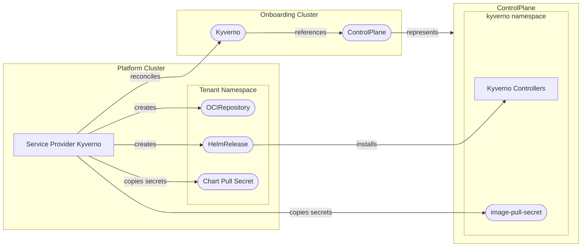

[](https://api.reuse.software/info/github.com/openmcp-project/service-provider-kyverno)

# 🛡️ service-provider-kyverno

A service provider for managing [Kyverno](https://kyverno.io/) deployments within a OpenControlPlane environment. This provider enables policy enforcement capabilities by automatically installing and configuring Kyverno on managed control planes.

## 📖 Overview

The Kyverno service provider automates the lifecycle management of Kyverno installations, including:

- 🔄 **Automated Kyverno Deployment** - Deploys Kyverno via Helm to `ControlPlanes`
- 🔑 **Secret Management** - Automatic copying of registry credentials across cluster boundaries
- 📊 **Status Tracking** - Status reporting of all managed resources

## 🏗️ Architecture



## 🚦 Getting Started

### Prerequisites

- Go 1.21+
- [Task](https://taskfile.dev/) (task runner)
- Docker (for building images)
- Access to an OpenControlPlane environment

### 🛠️ Local Development

1. **Clone the repository**

   ```bash
   git clone https://github.com/openmcp-project/service-provider-kyverno.git
   cd service-provider-kyverno
   ```

2. **Install dependencies**

   ```bash
   go mod download
   ```

3. **Build the binary**

   ```bash
   task build
   ```

4. **Run tests**

   ```bash
   task test
   ```

5. **Build the container image**

   ```bash
   task build:img:build
   ```

### 🧪 Running End-to-End Tests

```bash
task test-e2e
```

This will build the image and run the full e2e test suite.

## 📦 Installation

To install the Kyverno service provider, create a `ServiceProvider` resource in your platform cluster:

```yaml
apiVersion: openmcp.cloud/v1alpha1
kind: ServiceProvider
metadata:
  name: kyverno
  namespace: openmcp-system
spec:
  image: ghcr.io/openmcp-project/images/service-provider-kyverno:v1.0.0
```

## 📝 API Reference

### Kyverno

The `Kyverno` resource represents a Kyverno installation on a `ControlPlane`.

```yaml
apiVersion: kyverno.services.open-control-plane.io/v1alpha1
kind: Kyverno
metadata:
  name: my-kyverno
  namespace: default
spec:
  version: "3.3.7"
```

| Field          | Type   | Description                       |
| -------------- | ------ | --------------------------------- |
| `spec.version` | string | The version of Kyverno to install |

Note that the version must match one of the versions defined in the `ProviderConfig`.

### ProviderConfig

The `ProviderConfig` resource configures deployment settings for the Kyverno service provider.

```yaml
apiVersion: kyverno.services.open-control-plane.io/v1alpha1
kind: ProviderConfig
metadata:
  name: kyverno
spec:
  # Optional: Reconciliation interval
  pollInterval: "1m"
  # Required: list of installable Kyverno versions
  versions:
    - version: "v3.3.7"
      chartVersion: "3.3.7"
      # Optional: OCI URL of the Kyverno Helm chart
      chartURL: "oci://ghcr.io/kyverno/charts/kyverno"
      # Optional: Secret for private chart registry (must exist in the controller namespace)
      chartPullSecret: "image-registry-credentials"
      # Optional: Custom Helm values passed directly to the managed HelmRelease
      helmValues:
        global:
          imagePullSecrets:
            - name: "image-registry-credentials"
```

| Field                             | Type     | Description                                                                                                                                                                                                                                          |
| --------------------------------- | -------- | ---------------------------------------------------------------------------------------------------------------------------------------------------------------------------------------------------------------------------------------------------- |
| `spec.pollInterval`               | duration | How often to reconcile resources (default: `1m`)                                                                                                                                                                                                     |
| `spec.versions[].version`         | string   | Kyverno version string that maps to `Kyverno.spec.version`                                                                                                                                                                                           |
| `spec.versions[].chartVersion`    | string   | Helm chart version or digest to install                                                                                                                                                                                                              |
| `spec.versions[].chartURL`        | string   | OCI registry URL for the Helm chart (default: `oci://ghcr.io/kyverno/charts/kyverno`)                                                                                                                                                                |
| `spec.versions[].chartPullSecret` | string   | Secret name for chart registry authentication. Replicated into the tenant namespace with a `sp-kyverno-` prefix and cleaned up when the `Kyverno` resource is deleted.                                                                               |
| `spec.versions[].helmValues`      | object   | Arbitrary Helm values passed to the managed HelmRelease. Any secrets named in `helmValues.global.imagePullSecrets` are also replicated (prefixed `sp-kyverno-`) into the `kyverno` namespace on the ControlPlane cluster and cleaned up on deletion. |

## 🔧 Development Tasks

| Command                | Description                |
| ---------------------- | -------------------------- |
| `task build`           | Build the binary           |
| `task build:img:build` | Build the container image  |
| `task test`            | Run unit tests             |
| `task test-e2e`        | Run end-to-end tests       |
| `task generate`        | Generate CRDs and code     |
| `task validate`        | Run linters and formatters |

## Quality Criteria

[](https://open-control-plane.io/developers/serviceprovider/quality-criteria)

| Criterion                         | Status | Notes                                                                                                                                                                                             |
| --------------------------------- | :----: | ------------------------------------------------------------------------------------------------------------------------------------------------------------------------------------------------- |
| Deletion behaviour                |   ✅    |                                                                                                                                                                                                   |
| Status reporting & error messages |   ✅    |                                                                                                                                                                                                   |
| Operation annotations             |   ⚠️    | `openmcp.cloud/operation: ignore` is processed by [opencontrolplane-runtime](https://github.com/openmcp-project/opencontrolplane-runtime). `openmcp.cloud/operation: reconcile` is not processed. |
| API stability policy              |   ✅    |                                                                                                                                                                                                   |
| Custom CA support                 |   ❌    | Custom CA bundle propagation to Kyverno components is not implemented.                                                                                                                            |
| Release artifacts (image + OCM)   |   ✅    |                                                                                                                                                                                                   |
| Testing                           |   ✅    |                                                                                                                                                                                                   |
| Ownership and maintenance docs    |   ✅    |                                                                                                                                                                                                   |

See the [OpenControlPlane Quality Criteria](https://open-control-plane.io/developers/serviceprovider/quality-criteria) for definitions.

## 🤝 Support, Feedback, Contributing

This project is open to feature requests/suggestions, bug reports etc. via [GitHub issues](https://github.com/openmcp-project/service-provider-kyverno/issues). Contribution and feedback are encouraged and always welcome. For more information about how to contribute, the project structure, as well as additional contribution information, see our [Contribution Guidelines](https://github.com/openmcp-project/.github/blob/main/CONTRIBUTING.md).

## 🔒 Security / Disclosure

If you find any bug that may be a security problem, please follow our instructions at [in our security policy](https://github.com/openmcp-project/service-provider-kyverno/security/policy) on how to report it. Please do not create GitHub issues for security-related doubts or problems.

## 📜 Code of Conduct

We as members, contributors, and leaders pledge to make participation in our community a harassment-free experience for everyone. By participating in this project, you agree to abide by its [Code of Conduct](https://github.com/openmcp-project/.github/blob/main/CODE_OF_CONDUCT.md) at all times.

## 📄 Licensing

Copyright OpenControlPlane contributors. Please see our [LICENSE](LICENSE) for copyright and license information. Detailed information including third-party components and their licensing/copyright information is available [via the REUSE tool](https://api.reuse.software/info/github.com/openmcp-project/service-provider-kyverno).

---

<p align="center">
  <a href="https://apeirora.eu/content/projects/">
    
  </a>
</p>

<p align="center">
  OpenControlPlane is part of <a href="https://apeirora.eu/content/projects/">ApeiroRA</a>, an EU Important Project of Common European Interest (IPCEI-CIS).
</p>

<p align="center">
  Copyright Linux Foundation Europe. For web site terms of use, trademark policy and other project policies please see <a href="https://linuxfoundation.eu/en/policies">https://linuxfoundation.eu/en/policies</a>.
</p>
